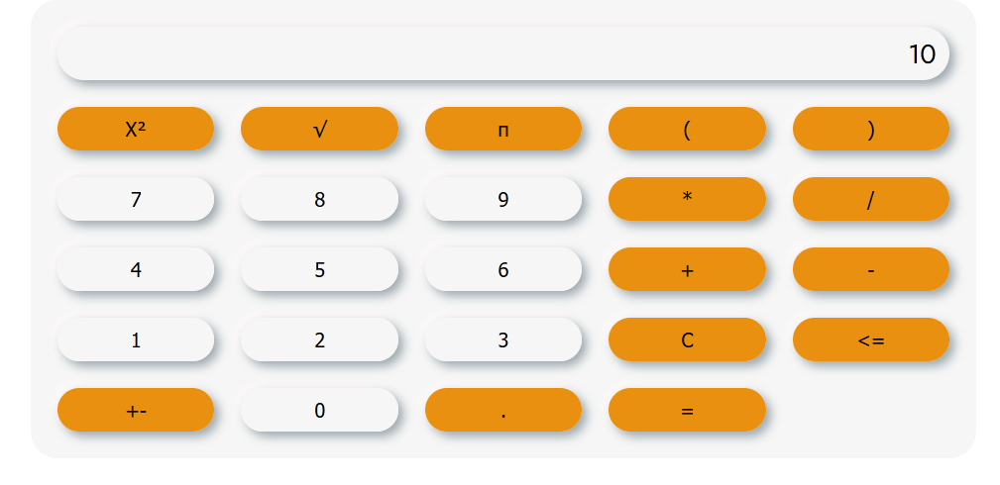
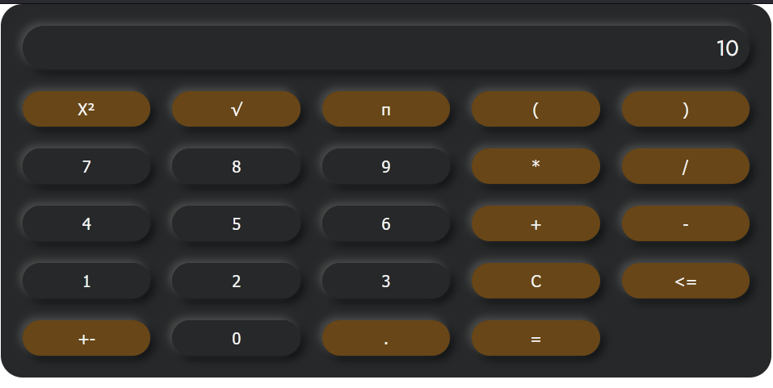

# 🧮 Calculator

## Présentation

Bienvenue sur **Calculator**, une calculatrice web moderne, responsive et entièrement générée en JavaScript. Ce projet met l'accent sur la qualité du code, la sécurité, l'expérience utilisateur et la maintenabilité. Il est pensé pour être un exemple de bonnes pratiques front-end.

---

## 🚀 Fonctionnalités principales

- **Calculatrice dynamique** : Génération de l'interface et de la logique en JS (aucun HTML statique pour la calculatrice)
- **Opérations de base** : Addition, soustraction, multiplication, division
- **Opérations avancées** : Carré, racine, pi, parenthèses
- **Gestion des erreurs** : Affichage d'un message clair en cas d'opération invalide (ex : division par zéro)
- **Sécurité** : Aucune exécution de code arbitraire, filtrage des entrées
- **Affichage intelligent** : Limitation de la longueur, arrondi des résultats, gestion du point décimal
- **Bouton backspace** : Efface le dernier caractère
- **Dark mode** : Prêt à l'emploi, activable par simple ajout d'une classe CSS
- **Responsive** : Adapté à tous les écrans (mobile, tablette, desktop)
- **Accessibilité** : Navigation clavier, feedback visuel
- **Tests unitaires** : Couverture complète des fonctionnalités avec Jest

---

## 🖥️ Aperçu

### Mode clair


### Mode sombre


---

## 🛠️ Installation & Lancement

1. **Cloner le repo**
   ```bash
   git clone https://github.com/xavcha03/calculator.git
   cd calculator
   ```
2. **Ouvrir `index.html`** dans votre navigateur préféré
3. **(Optionnel) Lancer les tests**
   ```bash
   npm install
   npx jest
   ```

---

## 📦 Structure du projet

```
calculator/
│
├── assets/
│   ├── js/
│   │   └── calculator/
│   │       ├── main.js         # Logique principale de la calculatrice
│   │       └── buttons.js      # Définition des boutons
│   │
│   ├── resDoc/                 # Images de documentation
│   └── scss/                   # Styles SCSS
│
├── index.html                  # Point d'entrée HTML
├── script.js                   # Initialisation du module Calculator
└── README.md                   # Ce fichier
```

---

## 📄 .gitignore

Ce projet utilise un fichier `.gitignore` adapté pour Node.js :
- `node_modules/` n'est jamais versionné
- Les fichiers de logs, de build, de test et de configuration locale sont exclus

Pensez à toujours installer les dépendances avec :
```bash
npm install
```

---

## ✨ Utilisation

Dans votre `index.html`, placez simplement :

```html
<main id="calculator" class="calc"></main>
```

Dans `script.js` :

```js
import Calculator from "./assets/js/calculator/main.js";
let calculator = new Calculator(document.querySelector("#calculator"));
```

---

## 🧪 Tests unitaires

Les tests couvrent toutes les fonctionnalités (calculs, erreurs, boutons, affichage, etc.).

- Fichier de test : `calculator.test.js`
- Lancement : `npx jest`

---

## 📋 Exemples de cas gérés

- `1 + 2 = 3`
- `5 / 0 = Erreur`
- `1 . . 2` → `1.2` (pas de double point)
- `8 / 0 = Erreur` puis `5` → reset automatique
- Limite d'affichage à 16 caractères
- Arrondi à 8 décimales

---

## 🏆 Pourquoi ce projet est remarquable ?

- **Code modulaire et maintenable**
- **Sécurité renforcée**
- **Expérience utilisateur soignée**
- **Prêt pour l'accessibilité et le responsive**
- **Tests unitaires exhaustifs**

---

## 🔗 Lien de démo

[Voir la calculatrice en ligne (GitHub Pages)](https://xavcha03.github.io/calculator/)

---

## 🙋‍♂️ Auteur

Xavier Chabert — [GitHub](https://github.com/xavcha03)

---

## 📈 Pour aller plus loin

- Ajouter d'autres opérations scientifiques
- Améliorer encore l'accessibilité (lecteurs d'écran, etc.)
- Ajouter un mode thème auto (en fonction du système)
- Internationalisation (i18n)

---

## 🎨 Compilation du SCSS

Pour générer le CSS à partir du SCSS :

```bash
npx sass assets/scss/main.scss:assets/styles/main.css --no-source-map --style=compressed
```

- Le CSS minifié sera généré dans `assets/styles/main.css`.
- (⚠️) Les imports SCSS utilisent la syntaxe @import, qui sera dépréciée à terme. Pour un projet long terme, migrer vers @use/@forward.

---

Ce projet met en avant les bonnes pratiques du développement front-end moderne, et peut servir de base solide pour des applications web plus ambitieuses.
